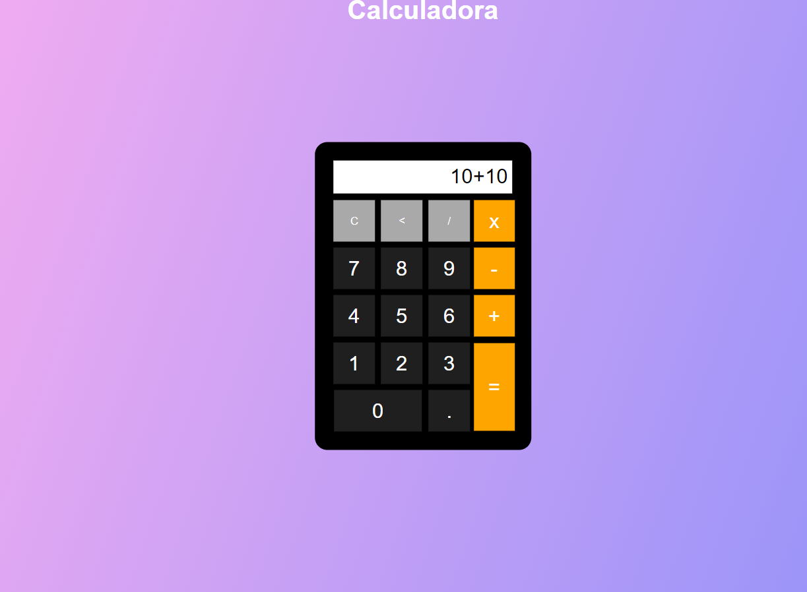

# Calculadora

### Descrição

Projeto que fiz para aperfeicoar meus conhecimentos em HTML,CSS e JavaScript.

### Rodando o projeto

Esse projeto usa hmtl,css e javascript puros, então basta abrir o arquivo html no seu navegador.

## Print

